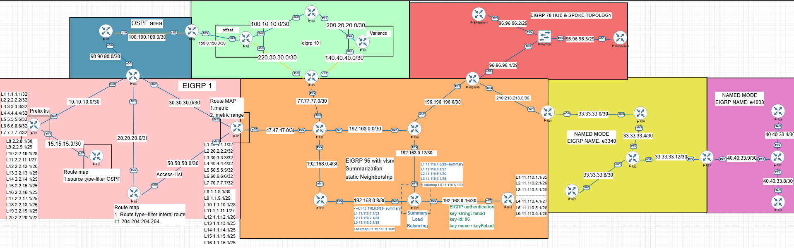

# 🏗️ EIGRP & OSPF Multi-Protocol Infrastructure Lab

## 🌐 Project Overview
This repository contains the complete design, configuration, and troubleshooting documentation for a large-scale EIGRP oriented network lab. The project focuses on the integration of disparate routing domains and the technical challenges of **Mutual Redistribution** across a complex topology.

**Key Technical Pillars:**
* **EIGRP Named Mode (AS e4033, e3340):** Modernized EIGRP deployment.
* **Multi-Area OSPF:** core backbone (Area 0).
* **Mutual Redistribution:** Route exchange between OSPF and EIGRP 1.
* **VLSM & Summarization:** Advanced IP management and routing table optimization in EIGRP 96.
* **Route Filtering:** Implementing Distribute-Lists and Route-Maps for loop prevention.

---

## 🔬 The "RIB Selection" Case Study
The highlight of this lab was resolving a **Sub-optimal Routing** issue at the boundary router (**R8**).

### **The Problem:**
Boundary Router **R8** was receiving the same prefixes like `140.40.40.0/30` from two different protocols:
1.  **OSPF:** Native advertisement (Default AD: 110)
2.  **EIGRP AS 96:** External advertisement (Default AD: 170)

In the internal "battle" for the **Routing Information Base (RIB)**, the router functioned as a **Judge**. It chose the OSPF path solely based on its lower Administrative Distance (110 vs 170), even though the native EIGRP path was the intended and physically superior route. This led to "poisoned" redistribution, where R8 advertised the OSPF-sourced path back into the EIGRP domain.

### **The Fix:**
I manually realigned the **Trust Hierarchy** by adjusting the **Administrative Distance** for EIGRP External routes on R8 to **110**. This forced the RIB to re-evaluate the two paths, allowing the native EIGRP path to be installed. This immediately halted the sub-optimal redistribution and restored optimal traffic flow.

---

## 📂 Project Structure & Evidence
* **[Topology Analysis](./topology.md):** A deep-dive into the design, packet captures, and routing logic.
* **[Configurations](./Configurations):** Complete `.txt` running-configs for all routers (R1 through R28).
* **[Topology-Snapshots](./Topology-Snapshots):** High-resolution topology maps and CLI verification screenshots.
* **[Troubleshooting-Analysis](./Troubleshooting.md):**  Technical deep-dive into a complex Sub optimal routing routes problem encountered at the boundary of EIGRP 1 and OSPF 2.

---

## 🚀 How to Use This Repo
1.  **Analyze the Topology:** View `topology.png` in the snapshots folder to understand the network layout.
2.  **Review Configurations:** Check the `/Configurations` folder for specific protocol implementations.
3.  **Troubleshooting Insight:** Refer to the `troubleshooting-evidence.md` file to see how AD manipulation and route filtering solve redistribution loops.

---

### **About the Author**
Networking Trainee specializing in enterprise routing/switching. I focus on a "why-first" analytical approach to troubleshooting to build elite-level network infrastructures.

#Cisco #Networking #EIGRP #OSPF #Routing #NetworkEngineering 
