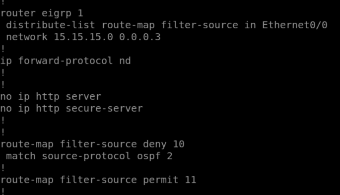

# 🛠️ Troubleshooting Case Study: Resolving the Mutual Redistribution Loop

This document provides a technical deep-dive into a complex Sub optimal routing routes problem encountered at the boundary of **EIGRP 1** and **OSPF 2**. It follows a systematic approach: Symptom Identification, Root Cause Analysis, Implementation of the Fix, Final Verification and Lab Observation.

---

## 🔍 Phase 1: Symptom & Problem Identification

### **1. The Conflict: Native EIGRP vs. Redistributed OSPF**
The core issue originated on **R8**. Because it sits on the boundary of two protocols, it received updates for the same network prefixes from both its native EIGRP neighbors and its OSPF neighbors. 

By default:
* **OSPF Administrative Distance (AD):** 110
* **EIGRP External AD:** 170

The "Judge" (RIB) preferred the OSPF path due to the lower AD, causing R8 to "lose trust" in its own EIGRP domain.

### **2. Evidence in the Routing Table**
The initial state of the RIB on R8 shows OSPF-sourced routes (`O E2`) overriding the EIGRP external paths.

> **Observation:** Note that the AD is 110. This caused R8 to stop using the optimal EIGRP path, leading to sub-optimal routing.

---

## 🔬 Phase 2: Packet-Level Analysis

To confirm the sub optimal routing, a live capture was performed on the link between **R8** and **R7**.

### **The "Poisoned" Update**

> **Analysis:** The capture reveals EIGRP updates with **External Protocol ID: OSPF (6)**. This proves that R8 was successfully preferring the OSPF route due to Administrative Distance and was flooding sub optimal routes into the EIGRP domain, creating traffic Congestion & Delay.

---

## ✅ Phase 3: The Engineering Solution

A two-pronged approach was used to realign the network's "Trust Hierarchy."

### **Step 1: AD Realignment on R8**
Adjusted the EIGRP process to treat external routes with the same level of trust as OSPF. This allowed the router to somehow choose EIGRP routes over and over even when OSPF routes metrics(Sub Optimal Routes) was clearly lower then EIGRP routes metric(Optimal Routes)

### **Step 2: Source-Protocol Filtering on R11**
To ensure absolute stability, a `route-map` was applied on R11 to deny any routes that were originally sourced from the OSPF domain from entering the EIGRP process.

> **Filter Logic:** `match source-protocol ospf 2` -> `deny`. This prevents the "Mutual Feedback" loop entirely.

---

## 📊 Phase 4: Final Verification

### **1. RIB Restoration**
After the AD manipulation, the `show ip route` command on R8 confirms that the native EIGRP paths (`D EX`) have reclaimed the spot as the "Winner" in the routing table.

> Note: OPSF domain own route(optimal route for the following prefix) was also added.

### **2. Clean Control Plane Capture**
The final packet capture confirms the protocol "flood" has stopped. The updates now correctly show the native EIGRP source.

---
## Lab Observation: RIB Selection and Protocol Preemption (EIGRP vs. OSPF)

### Scenario Overview
During this lab, I manually modified the Administrative Distance (AD) for **EIGRP External** to **110** to match the default AD of **OSPF**. Despite setting an identical distance, router R8 consistently preferred the EIGRP route over the OSPF route. This occurred even when the OSPF route was already established in the Routing Information Base (RIB), meaning the EIGRP route successfully preempted it once the adjacency was restored.

### Technical Analysis: The Tie-Breaker Logic
When a Cisco router receives multiple advertisements for the exact same prefix with identical Administrative Distances from different routing protocols, it does not perform load balancing or "first-come, first-served" selection. Instead, it seems to utilize some kind of a complex deterministic internal selection process.

#### 1. Internal Protocol Priority (Administrative Weight)
Based on my observations, the router might be utilizing a hard-coded internal priority hierarchy to ensure predictable routing behavior. Even when the AD is tied, the RIB manager refers to an internal weight assigned to each protocol. 

The internal preference hierarchy (from highest to lowest) appears to be:
1. **Connected**
2. **Static**
3. **EIGRP**
4. **OSPF**

Because **EIGRP** is positioned higher in this internal architectural hierarchy than **OSPF**, the router views the EIGRP update as a "higher quality" source. As a result, it preempts any existing OSPF route to install the EIGRP path instead.

#### 2. Deterministic Stability
My theory is that this behavior is designed to prevent "race conditions" where the routing table depends on which neighbor adjacency forms first. By using a hard-coded priority, the router ensures that the network state remains consistent across reboots and link flaps, rather than being determined by timing or luck.

### Final Conclusion
The router installs EIGRP routes over OSPF because, in a manual AD tie, Cisco IOS utilizes a deterministic internal protocol priority. Since EIGRP has a higher internal preference than OSPF within the RIB manager's logic, it always preempt the OSPF route to maintain a stable and predictable routing table. But then this raises the question of why OSPF route for `100.100.100.0` was added in RIB? There might be an unknown architectural factor affecting this whole process which i'm not aware of.

> **Note:** I wasn't able to find any official documentation online that references this specific behavior. These conclusions are based entirely on my own lab observations in EVE. If this interpretation is incorrect, Please correct me.
---
## 📂 Reference Documentation
* **Original Config:** [R8-old-EIGRP&OSPF-config.png](./Troubleshooting-Evidence/R8-old-EIGRP%26OSPF-config.png)
* **Pre-Filter State:** [R11-routes available before_2.png](./Troubleshooting-Evidence/R11-routes%20available%20before.png)

---
*Deep-Dive Troubleshooting performed by Fahad Khan*
