# 🗺️ Topology Analysis & Control Plane Verification

This document provides a detailed breakdown of the enterprise topology, the protocol interaction logic, and the evidence used to verify the "RIB Judge" theory.

## 📍 Network Domains
The lab is divided into several specialized routing domains to simulate a diverse enterprise environment:

### **1. OSPF Backbone (Blue Zone)**
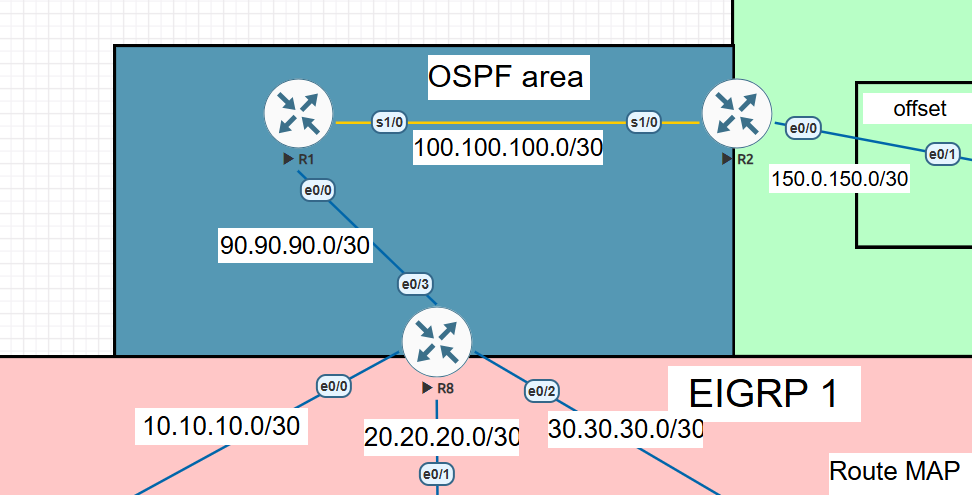
* **Role:** Acts as the primary transit backbone for the core.
* **Area Design:** Features Area 0.
* **Key Routers:** R1, R2, and R8.
* **Configuration**
* **Router 1**
* 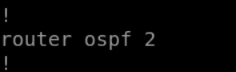
* **Router 2**
* 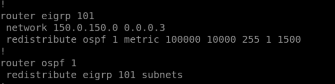
* **Router 8**
* 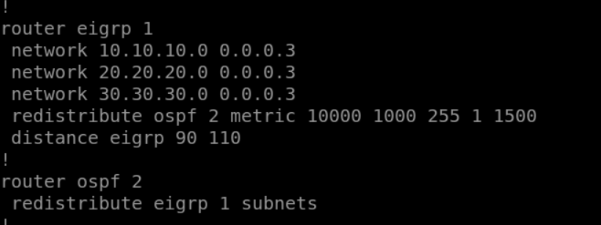


### **2. EIGRP 96 (Orange Zone)**
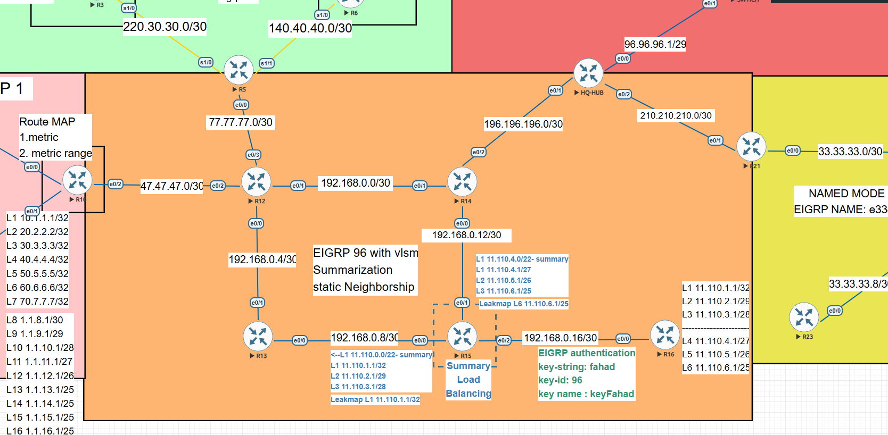
* **Role:** Highly controlled stub/specialized site.
* **Features:** Utilizes **Static Neighborships** to eliminate multicast overhead and **VLSM Summarization** to keep the routing table lean.
* **Key Routers:** R5, R12,R13,R14,R15,R16, HQ-Hub,R10,R21,.
* **Router 5**
  * 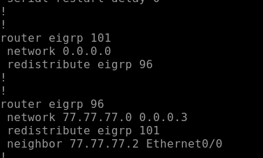
  * **Router 5 EIGRP NEIGHBORS**
  * 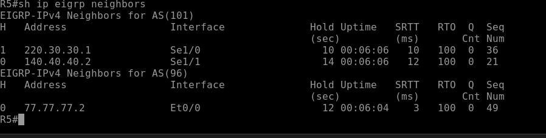

* **Router 16**
  * 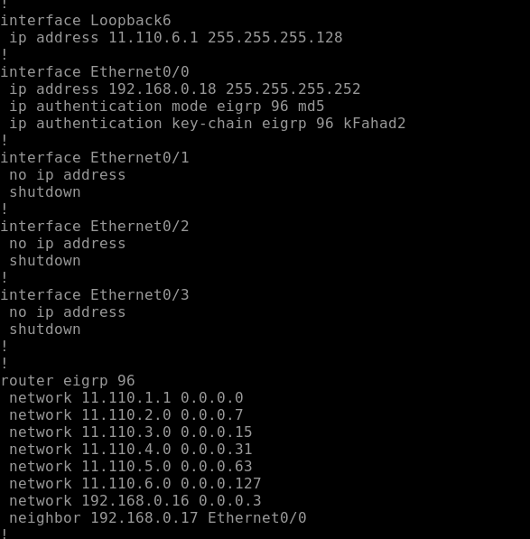
  * **Router 16 EIGRP NEIGHBORS**
   * 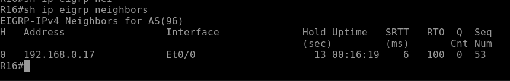
  
* **Router 21**
  * 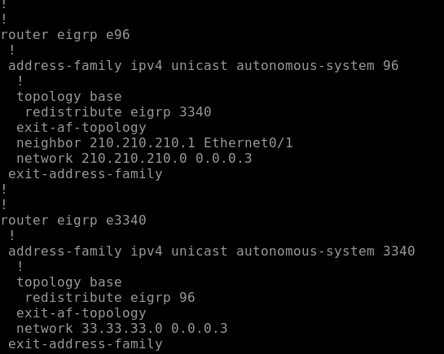
  * **Router 21 EIGRP NEIGHBORS**
  * 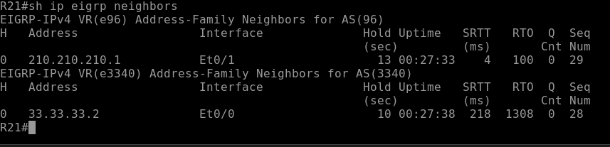

* **Router 15**
  * 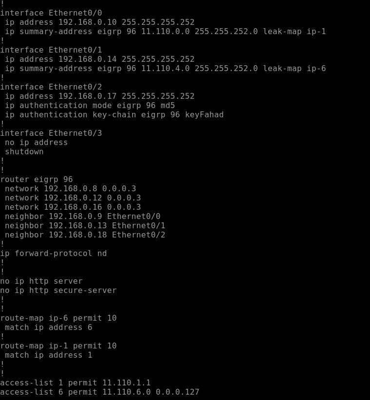
  * **Router 15 Key Chain**
  * 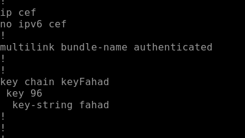
  * **Router 15 Leak Map Result**
  * 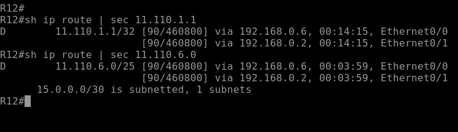
  * **Router 15 EIGRP NEIGHBORS**
  * 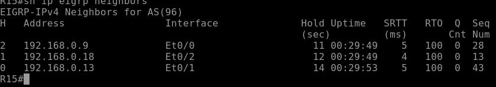
 
* **Router 14**
  * 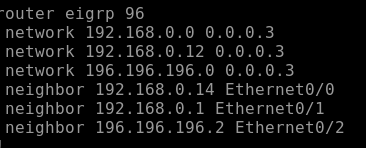
  * **Router 14 EIGRP NEIGHBORS**
  * 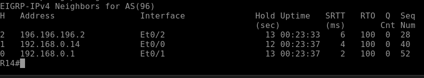

* **Router 13**
  * 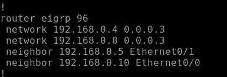
  * **Router 13 EIGRP NEIGHBORS**
  * 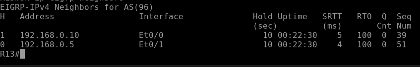

* **Router 12**
  * 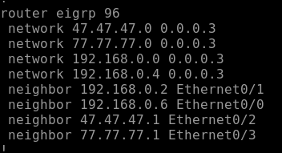
  * **Router 12 EIGRP NEIGHBORS**
  * 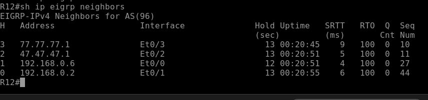

* **Router 10**
  * 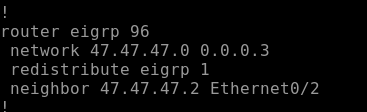
  * **Router 10 EIGRP NEIGHBORS**
  * 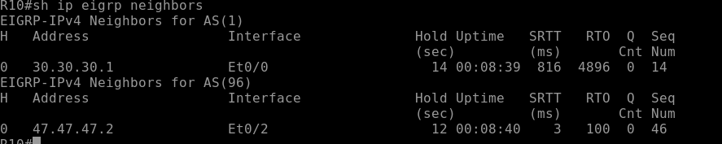

* **HQ-HUB**
  * 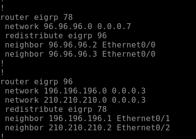

### **3. EIGRP 1 (Red Zones)**
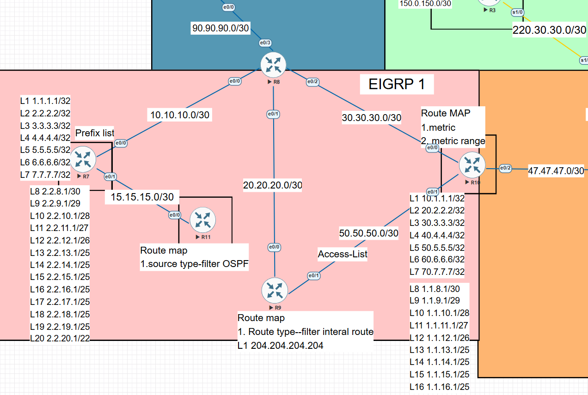
* **Role:** The primary redistribution domain and the site of the RIB conflict.
* **Features:** Implemented EIGRP Route filtering
* **Key Routers:** R10, R11, R7, R8, R9.

* **Router 10**
  * 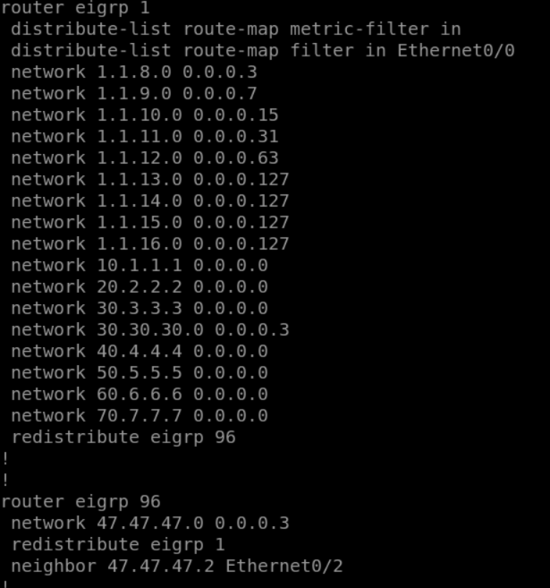
  * **Router 10 Metric Range**
  * 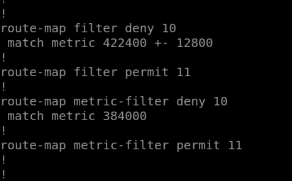

* **Router 11**
  * 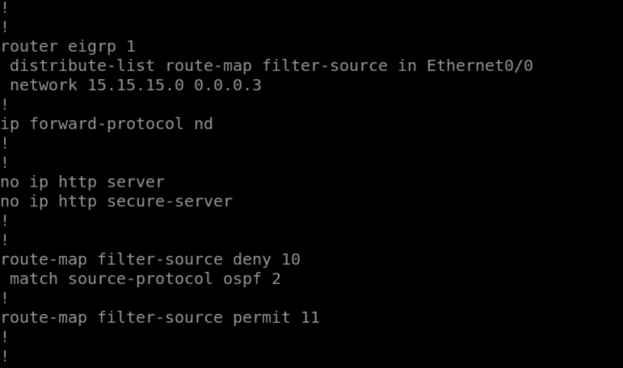
  * **Router 11 Traceroute To OSPF Domain**
  * 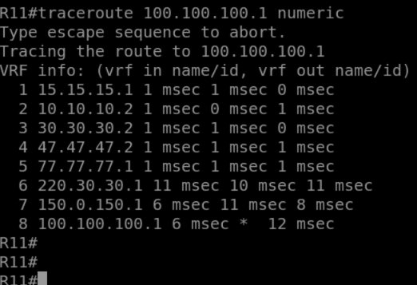

* **Router 7**
  * 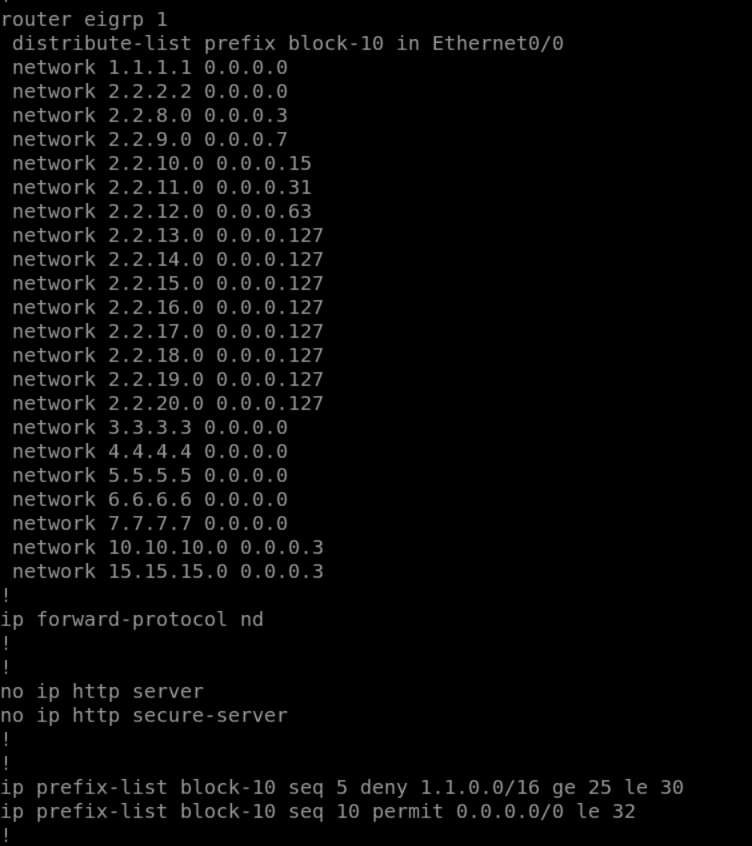

* **Router 8**
  * 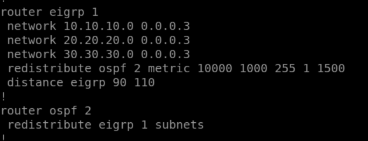

* **Router 9**
  * 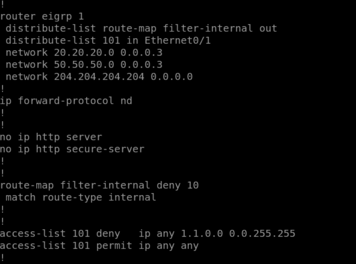
  * **Router 9 Loopback Internal Block**
  * 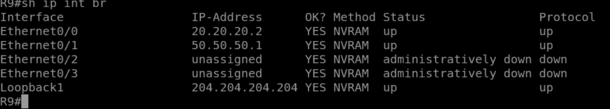


    
### **3. EIGRP Named Mode (Purple/Yellow Zones)**
* **Role:** Modernized EIGRP implementation using Address Families.
* **Instances:** `e4033` and `e3340`.
* **Features:** Demonstrates the scalability of Named Mode configuration over Classic EIGRP.

### **4. EIGRP 1 (Red Zone)**
* **Role:** The primary redistribution domain and the site of the RIB conflict.

---

## 🔬 Control Plane Case Study: R8 Boundary

### **The Race Condition**
A critical "Internal Battle" was observed at R8. Because R8 was connected to both OSPF (Area 0) and EIGRP 1, it received information for the same network from two different Gatherers.


| Gatherer | Path Source | AD Offer | Status in RIB |
| :--- | :--- | :--- | :--- |
| **OSPF** | R1 (Direct) | 110 | **Winner (Installed)** |
| **EIGRP** | R10 (Indirect) | 170 | **Loser (Backup)** |

### **The Redistribution Trap**
Because the RIB (The Judge) only accepts the OSPF route, the `redistribute ospf` command exported that OSPF-sourced route into the EIGRP domain. This caused R7 to believe the best path was through R8, leading to sub-optimal routing.

---

## 📊 Verification Evidence

### **1. Redistribution Metric Steering**
To ensure the "Exporter" (Redistribution) sent the correct cost information into EIGRP, the following seed metric was applied at R8:
`redistribute ospf 2 metric 10000 1000 255 1 1500`


* **Bandwidth:** 10,000 Kbit
* **Delay:** 1,000 (10ms)
* **Resulting Metric:** 512,000

### **2. Packet Capture Verification**
Live captures were taken on the R8-R7 link to confirm protocol behavior.

* **Capture - Loop Identified:** `Live-packet-capture of EIGRP with the OSPF routes sharing problem.jpg`
  * *Observation:* The packet capture shows EIGRP Update packets carrying routes with an **External Protocol ID: OSPF (6)**. This proves R8 was "seduced" by the OSPF route.

* **Capture - Fix Verified:** `Live-packet-capture of EIGRP with the Solved-OSPF routes sharing problem.jpg`
  * *Observation:* After the AD adjustment to 110 on R8, the capture shows R8 correctly advertising the **Native EIGRP** path, effectively stopping the OSPF flood.

---

## 🛡️ Stability Mechanisms

### **Route Filtering at R11**
To prevent "Mutual Feedback" (where a redistributed route enters another redistribution point), a Distribute-List was applied:
```text
route-map filter-source deny 10
 match source-protocol ospf 2
!
route-map filter-source permit 20
