# 🗺️ Topology Analysis & Control Plane Verification

This document provides a detailed breakdown of the enterprise topology, the protocol interaction logic, and the evidence used to verify the "RIB Judge" theory.

## 📍 Network Domains
The lab is divided into several specialized routing domains to simulate a diverse enterprise environment:

### **1. OSPF Backbone (Blue Zone)**

* **Role:** Acts as the primary transit backbone for the core.
* **Area Design:** Features Area 0.
* **Key Routers:** **[R1](./Configurations/OSPF/R1.txt)** , **[R2](./Configurations/OSPF/R2.txt)** ,  **[R8](./Configurations/OSPF/R8.txt)**
* **Configuration**
* **Router 1**
* 
* **Router 2**
* 
* **Router 8**
* 
* **Routers Configurations**

 
### **2. EIGRP 96 (Orange Zone)**

* **Role:** Highly controlled stub/specialized site.
* **Features:** Utilizes **Static Neighborships** to eliminate multicast overhead and **VLSM Summarization** to keep the routing table lean.
* **Key Routers:** **[R5](./Configurations/EIGRP-96/R5.txt)** , **[R12](./Configurations/EIGRP-96/R12.txt)** , **[R13](./Configurations/EIGRP-96/R13.txt)** , **[R14](./Configurations/EIGRP-96/R14.txt)** , **[R15](./Configurations/EIGRP-96/R15.txt)** , **[R16](./Configurations/EIGRP-96/R16.txt)** , **[HQ-Hub](./Configurations/EIGRP-96/HQ-HUB.txt)** , **[R10](./Configurations/EIGRP-96/R10.txt)** , **[R21](./Configurations/EIGRP-96/R21.txt)**.
* **Router 5**
  * 
  * **Router 5 EIGRP NEIGHBORS**
  * 

* **Router 16**
  * 
  * **Router 16 EIGRP NEIGHBORS**
   * 
  
* **Router 21**
  * 
  * **Router 21 EIGRP NEIGHBORS**
  * 

* **Router 15**
  * 
  * **Router 15 Key Chain**
  * 
  * **Router 15 Leak Map Result**
  * 
  * **Router 15 EIGRP NEIGHBORS**
  * 
 
* **Router 14**
  * 
  * **Router 14 EIGRP NEIGHBORS**
  * 

* **Router 13**
  * 
  * **Router 13 EIGRP NEIGHBORS**
  * 

* **Router 12**
  * 
  * **Router 12 EIGRP NEIGHBORS**
  * 

* **Router 10**
  * 
  * **Router 10 EIGRP NEIGHBORS**
  * 

* **HQ-HUB**
  * 

### **3. EIGRP 1 (Pink Zones)**

* **Role:** The primary redistribution domain and the site of the RIB conflict.
* **Features:** Implemented EIGRP Route filtering
* **Key Routers:**  **[R10](./Configurations/EIGRP-1/R10.txt)** , **[R11](./Configurations/EIGRP-1/R11.txt)**, **[R7,](./Configurations/EIGRP-1/R7.txt)** , **[R8](./Configurations/OSPF/R8.txt)** ,  **[R9](./Configurations/EIGRP-1/R9.txt)**.
* **NOTE:** IP route snapshots for all EIGRP 1 routers are available in the **[Config folder](./Configurations/EIGRP-1/)** to review aside from R8.
* 
* **Router 10**
  * 
  * **Router 10 Metric Range**
  * 

* **Router 11**
  * 
  * **Router 11 Traceroute To OSPF Domain**
  * 

* **Router 7**
  * 

* **Router 8**
  * 

* **Router 9**
  * 
  * **Router 9 Loopback Internal Block**
  * 
  * **Router 9 Access List Block Route from e0/1 port**
  * 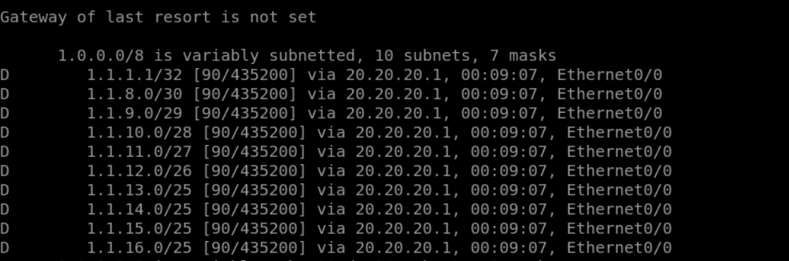

### **4. EIGRP 101(Green Zone)**
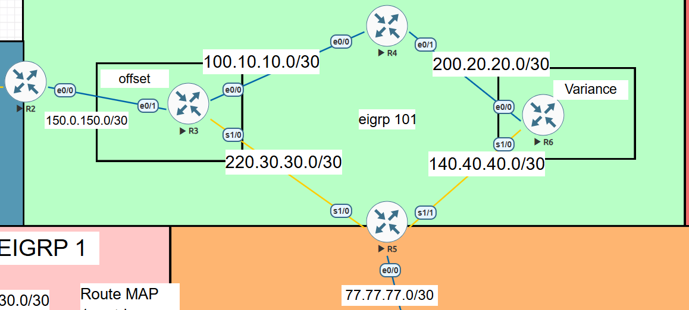
* **Features:**  EIGRP Load balancing implementation using Offset as well as Variance.
* **Key Routers:** **[R2](./Configurations/EIGRP-101/R2.txt)** , **[R3](./Configurations/EIGRP-101/R3.txt)**, **[R4](./Configurations/EIGRP-101/R4.txt)** , **[R5](./Configurations/EIGRP-101/R5.txt)** , **[R6](./Configurations/EIGRP-101/R6.txt)**.

* **Router 2**
  * 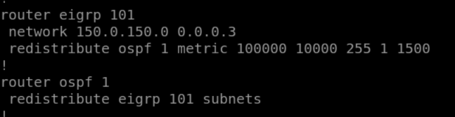

* **Router 3**
  * 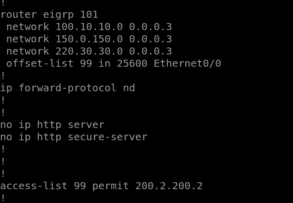

* **Router 4**
  * 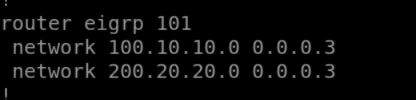

* **Router 5**
  * 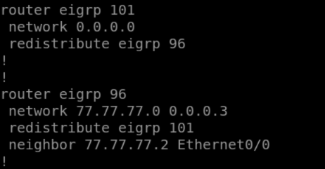

* **Router 6**
  * 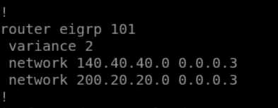

### **4. EIGRP Hub & Spoke topology (RED Zone)**

* **Features:**  EIGRP Hub and Spoke Topology implementated for monitioring of the data using a central device.
* **Key Routers:** **[Hub](./Configurations/Hub%20%26%20Spoke%20topology/hub-config.txt)** , **[Br-Spoke-1](./Configurations/Hub%20%26%20Spoke%20topology/Br-spoke-1.txt)** , **[Br-Spoke-2](./Configurations/Hub%20%26%20Spoke%20topology/Br-spoke-2.txt)**.  

* **HUB **
  * 

* **Br-spoke-1 **
  * 

* **Br-spoke-2 **
  * 

### **3. EIGRP Named Mode (Purple/Yellow Zones)**
* **Role:** Modernized EIGRP implementation using Address Families.
* **Instances:** `e4033` and `e3340`.
* **Features:** Demonstrates the scalability of Named Mode configuration over Classic EIGRP.
* ### ***EIGRP E3340**
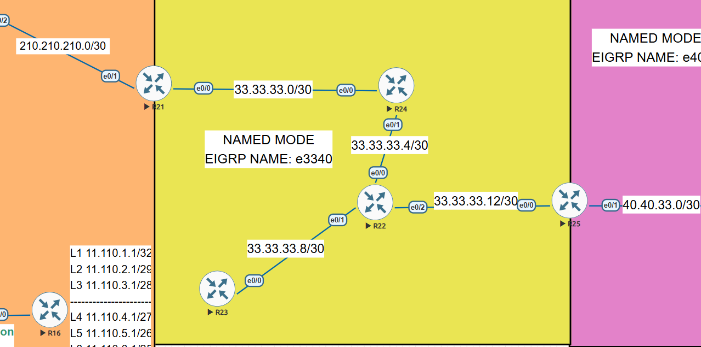
* **Key Routers:** **[R21](./Configurations/EIGRP-NAMED-mode-e3340/R21.txt)** , **[R22](./Configurations/EIGRP-NAMED-mode-e3340/R22.txt)** , **[R23](./Configurations/EIGRP-NAMED-mode-e3340/R23.txt)** , **[R24](./Configurations/EIGRP-NAMED-mode-e3340/R24.txt)**.
* * **Router 21**
  * 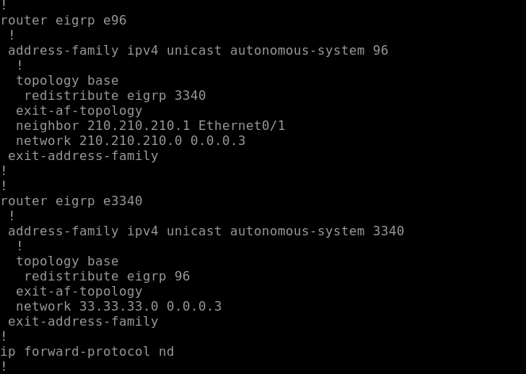
  * **Router 21 EIGRP NEIGHBORS**
  * 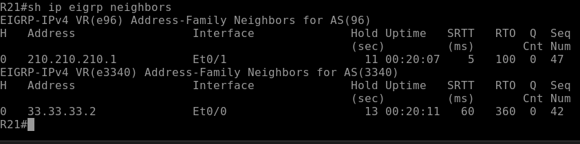
* * **Router 22**
  * 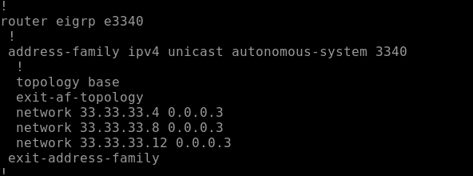
  * **Router 22 EIGRP NEIGHBORS**
  * 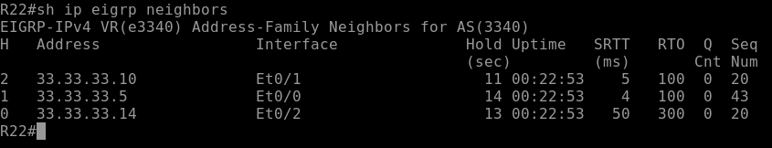
* * **Router 23**
  * 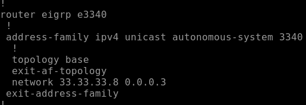
  * **Router 23 EIGRP NEIGHBORS**
  * 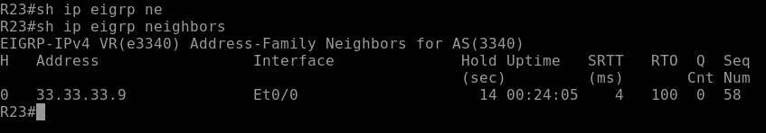
* * **Router 24**
  * 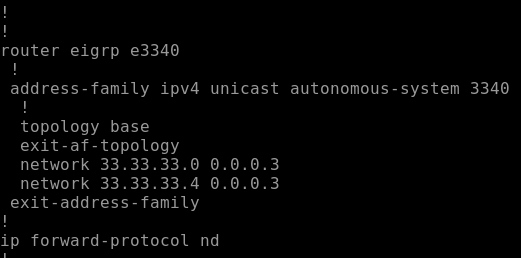
  * **Router 24 EIGRP NEIGHBORS**
  * 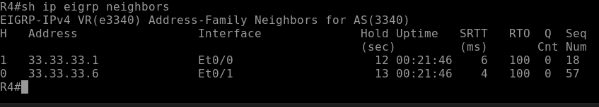
    
* ### ***EIGRP E4033**
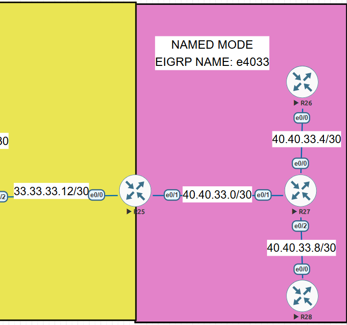
* **Key Routers:** **[R25](./Configurations/EIGRP-NAMED-mode-e4033/R25.txt)** , **[R26](./Configurations/EIGRP-NAMED-mode-e4033/R26.txt)** , **[R27](./Configurations/EIGRP-NAMED-mode-e4033/R27.txt)** , **[R28](./Configurations/EIGRP-NAMED-mode-e4033/R28.txt)**.

* * **Router 25**
  * 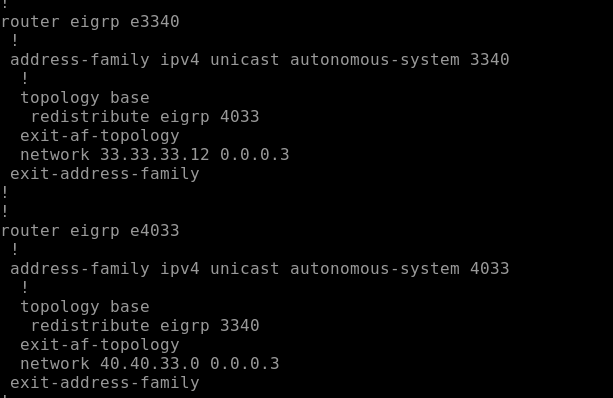
  * **Router 25 EIGRP NEIGHBORS**
  * 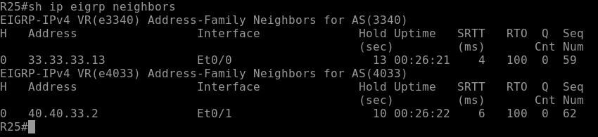

* * **Router 26**
  * 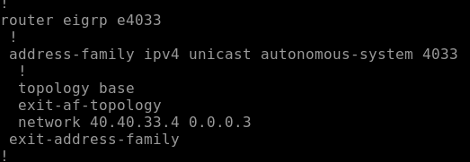
  * **Router 26 EIGRP NEIGHBORS**
  * 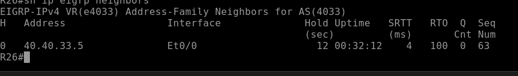
  
* * **Router 27**
  * 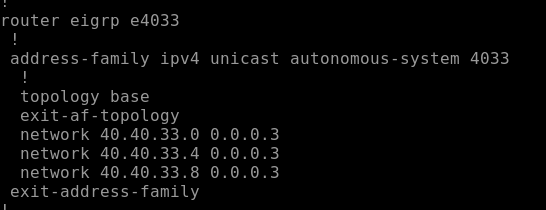
  * **Router 27 EIGRP NEIGHBORS**
  * 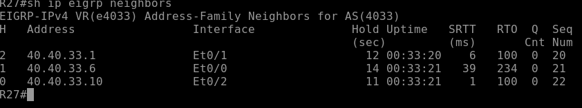
  
* * **Router 28**
  * 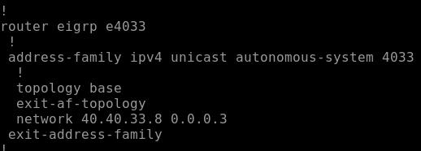
  * **Router 28 EIGRP NEIGHBORS**
  * 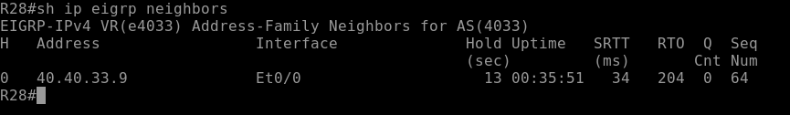
  
    
